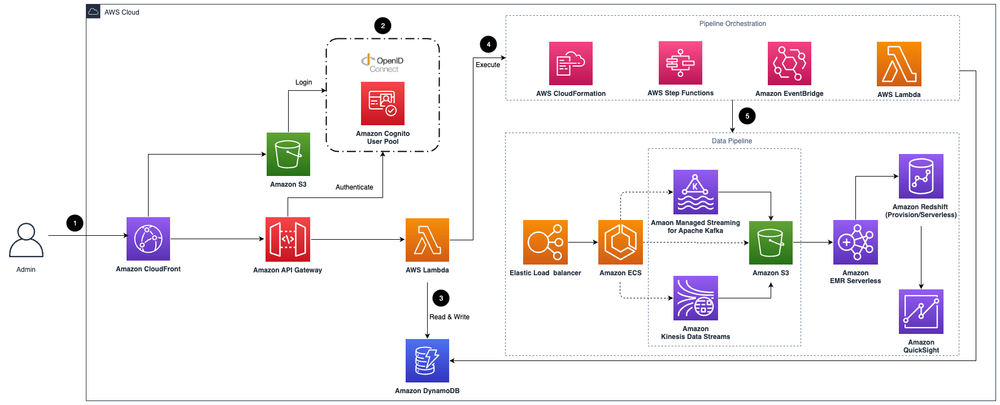

# Clickstream Analytics on AWS

An AWS Solution builds clickstream analytic system on AWS with a click-through experience.
This solution automates the data pipeline creation per configurations,
and provides SDKs for web and mobiles apps to help users to collect and ingest client-side data into the data pipeline on AWS.
The solution allows you to further enrich, model, and distribute the event data for business function teams (e.g., marketing, operation) to consume,
and provides a dozen of built-in visualizations (e.g., acquisition, engagement, retention, user demographic)
and explorative reporting templates (e.g., funnel, use path, user explorer),
powering the use cases such as user behavior analytics, marketing analytics, and product analytics.

## Architecutre of solution



1. Amazon CloudFront distributes the frontend web UI assets hosted in the Amazon S3 bucket, and the backend APIs hosted with Amazon API Gateway and AWS Lambda.
2. The Amazon Cognito user pool or OpenID Connect (OIDC) is used for authentication.
3. The web UI console uses Amazon DynamoDB to store persistent data.
4. AWS Step Functions, AWS CloudFormation, AWS Lambda, and[Amazon EventBridge are used for orchestrating the lifecycle management of data pipelines.
5. The data pipeline is provisioned in the region specified by the system operator. It consists of Application Load Balancer (ALB),
Amazon ECS, Amazon Managed Streaming for Kafka (Amazon MSK), Amazon Kinesis Data Streams, Amazon S3, Amazon EMR Serverless, Amazon Redshift, and Amazon QuickSight.

See [the doc](./docs/en/architecture.md) for more detail.

## How to deploy the solution

Follow the [implementation guide](./docs/en/deployment/index.md) to deploy the solution with few clicks.

### Deploy from source

#### Prerequisites

- An AWS account
- Configure [credential of aws cli][configure-aws-cli]
- Install node.js LTS version 16.18.0 at least
- Install Docker Engine
- Install the dependencies of solution via executing command `yarn install --check-files && npx projen`
- Initialize the CDK toolkit stack into AWS environment(only for deploying via [AWS CDK][aws-cdk] first time), run `npx cdk bootstrap`

#### Deploy web console

```shell
# deploy the web console of the solution
npx cdk deploy cloudfront-s3-control-plane-stack-global --parameters Email=<your email> --require-approval never
```

## How to test

```shell
yarn test
```

## Security

See [CONTRIBUTING](CONTRIBUTING.md#security-issue-notifications) for more information.

## License

This project is licensed under the Apache-2.0 License.

[configure-aws-cli]: https://docs.aws.amazon.com/zh_cn/cli/latest/userguide/cli-chap-configure.html
[aws-cdk]: https://aws.amazon.com/cdk/
