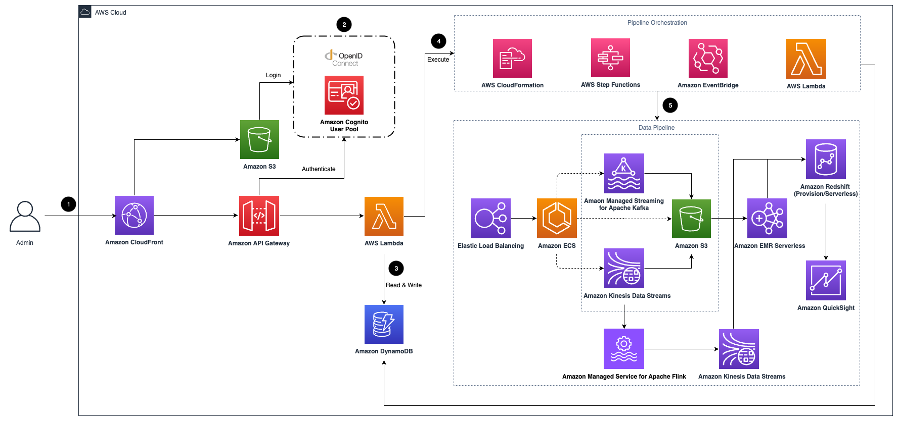

# Clickstream Analytics on AWS

An end-to-end solution to collect, ingest, analyze, and visualize clickstream data inside your web and mobile applications.

## Solution Overview

This solution collects, ingests, analyzes, and visualizes clickstreams from your websites and mobile applications. Clickstream data is critical for online business analytics use cases, such as user behavior analysis, customer data platform, and marketing analysis. This data derives insights into the patterns of user interactions on a website or application, helping businesses understand user navigation, preferences, and engagement levels to drive product innovation and optimize marketing investments.

With this solution, you can quickly configure and deploy a data pipeline that fits your business and technical needs. It provides purpose-built software development kits (SDKs) that automatically collect common events and easy-to-use APIs to report custom events, enabling you to easily send your customers’ clickstream data to the data pipeline in your AWS account. The solution also offers pre-assembled dashboards that visualize key metrics about user lifecycle, including acquisition, engagement, activity, and retention, and adds visibility into user devices and geographies. You can combine user behavior data with business backend data to create a comprehensive data platform and generate insights that drive business growth.

## Architecture Overview



1. Amazon CloudFront distributes the frontend web UI assets hosted in the Amazon S3 bucket, and the backend APIs hosted with Amazon API Gateway and AWS Lambda.
2. The Amazon Cognito user pool or OpenID Connect (OIDC) is used for authentication.
3. The web UI console uses Amazon DynamoDB to store persistent data.
4. AWS Step Functions, AWS CloudFormation, AWS Lambda, and Amazon EventBridge are used for orchestrating the lifecycle management of data pipelines.
5. The data pipeline is provisioned in the Region specified by the system operator. It consists of Application Load Balancer (ALB),
Amazon ECS, Amazon Managed Streaming for Kafka (Amazon MSK), Amazon Kinesis Data Streams, Amazon S3, Amazon EMR Serverless, Amazon Redshift, and Amazon QuickSight.

For more information, refer to [the doc][doc-arch].

## SDKs

Clickstream Analytics on AWS provides different client-side SDKs, which can make it easier for you to report events to the data pipeline created in the solution. Currently, the solution supports the following platforms:

- [Android][android-sdk]
- [Swift][swift-sdk]
- [Web][web-sdk]
- [Flutter][flutter-sdk]
- [WeChat Mini Program][wechat-sdk]
- [HTTP API][http-api]

See [this repo][sdk-samples] for different kinds of SDK samples.

## Deployment

### Using AWS CloudFormation template

Follow the [implementation guide][doc-deployment] to deploy the solution using AWS CloudFormation template.

### Using AWS CDK

#### Preparations

- Make sure you have an AWS account
- Configure [credential of aws cli][configure-aws-cli]
- Install Node.js LTS version 18.17.0 or later
- Install Docker Engine
- Install the dependencies of the solution by executing the command `yarn install --check-files && npx projen`
- Initialize the CDK toolkit stack into AWS environment (only for deploying via [AWS CDK][aws-cdk] for the first time), and run `npx cdk bootstrap`

#### Deploy the web console

```shell
# deploy the web console of the solution
npx cdk deploy cloudfront-s3-control-plane-stack-global --parameters Email=<your email> --require-approval never
```

#### Deploy pipeline stacks

```shell
# deploy the ingestion server with s3 sink
# 1. check stack name in src/main.ts for other stacks
# 2. check the stack for required CloudFormation parameters
npx cdk deploy ingestion-server-s3-stack --parameters ...
```

#### Deploy local code for updating existing stacks created by the web console

```shell
# update the existing data modeling Redshift stack Clickstream-DataModelingRedshift-xxx
bash e2e-deploy.sh modelRedshiftStackName Clickstream-DataModelingRedshift-xxx
```

## Test

```shell
yarn test
```

## Local development for web console

- Step1: Deploy the solution control plane(create DynamoDB tables, State Machine and other resources). 
- Step2: Open **Amazon Cognito** console, select the corresponding **User pool**, click the **App integration** tab, select application details in the **App client list**, edit **Hosted UI**, and set a new URL: `http://localhost:3000/signin` into **Allowed callback URLs**.
- Step3: Goto the folder: `src/control-plane/local`

```shell
cd src/control-plane/local
```

```shell
# run backend server local
bash start.sh -s backend
```

```shell
# run frontend server local
bash start.sh -s frontend
```

## Security

See [CONTRIBUTING](CONTRIBUTING.md#security-issue-notifications) for more information.

## License

This project is licensed under the Apache-2.0 License.

## File Structure

Upon successfully cloning the repository into your local development environment but prior to running the initialization script, you will see the following file structure in your editor:

```
├── CHANGELOG.md                       [Change log file]
├── CODE_OF_CONDUCT.md                 [Code of conduct file]
├── CONTRIBUTING.md                    [Contribution guide]
├── LICENSE                            [LICENSE for this solution]
├── NOTICE.txt                         [Notice for 3rd-party libraries]
├── README.md                          [Read me file]
├── buildspec.yml
├── cdk.json
├── codescan-prebuild-custom.sh
├── deployment                         [shell scripts for packaging distribution assets]
│   ├── build-open-source-dist.sh
│   ├── build-s3-dist-1.sh
│   ├── build-s3-dist.sh
│   ├── cdk-solution-helper
│   ├── post-build-1
│   ├── run-all-test.sh
│   ├── solution_config
│   ├── test
│   ├── test-build-dist.sh
│   └── test-deploy-tag-images.sh
├── docs                               [document]
│   ├── en
│   ├── index.html
│   ├── mkdocs.base.yml
│   ├── mkdocs.en.yml
│   ├── mkdocs.zh.yml
│   ├── site
│   ├── test-deploy-mkdocs.sh
│   └── zh
├── examples                           [example code]
│   ├── custom-plugins
│   └── standalone-data-generator
├── frontend                           [frontend source code]
│   ├── README.md
│   ├── build
│   ├── config
│   ├── esbuild.ts
│   ├── node_modules
│   ├── package.json
│   ├── public
│   ├── scripts
│   ├── src
│   ├── tsconfig.json
│   └── yarn.lock
├── package.json
├── sonar-project.properties
├── src                                [all backend source code]
│   ├── alb-control-plane-stack.ts
│   ├── analytics
│   ├── cloudfront-control-plane-stack.ts
│   ├── common
│   ├── control-plane
│   ├── data-analytics-redshift-stack.ts
│   ├── data-modeling-athena-stack.ts
│   ├── data-pipeline
│   ├── data-pipeline-stack.ts
│   ├── data-reporting-quicksight-stack.ts
│   ├── ingestion-server
│   ├── ingestion-server-stack.ts
│   ├── kafka-s3-connector-stack.ts
│   ├── main.ts
│   ├── metrics
│   ├── metrics-stack.ts
│   └── reporting
├── test                               [test code]
│   ├── analytics
│   ├── common
│   ├── constants.ts
│   ├── control-plane
│   ├── data-pipeline
│   ├── ingestion-server
│   ├── jestEnv.js
│   ├── metrics
│   ├── reporting
│   ├── rules.ts
│   └── utils.ts
├── tsconfig.dev.json
├── tsconfig.json
└── yarn.lock
```

[android-sdk]: https://github.com/awslabs/clickstream-android
[swift-sdk]: https://github.com/awslabs/clickstream-swift
[flutter-sdk]: https://github.com/awslabs/clickstream-flutter
[web-sdk]: https://github.com/awslabs/clickstream-web
[wechat-sdk]: https://github.com/awslabs/clickstream-wechat
[http-api]: https://awslabs.github.io/clickstream-analytics-on-aws/en/latest/sdk-manual/http-api/
[configure-aws-cli]: https://docs.aws.amazon.com/zh_cn/cli/latest/userguide/cli-chap-configure.html
[aws-cdk]: https://aws.amazon.com/cdk/
[doc-arch]: https://docs.aws.amazon.com/solutions/latest/clickstream-analytics-on-aws/architecture-overview.html
[doc-deployment]: https://docs.aws.amazon.com/solutions/latest/clickstream-analytics-on-aws/deployment.html
[sdk-samples]: https://github.com/aws-samples/clickstream-sdk-samples
