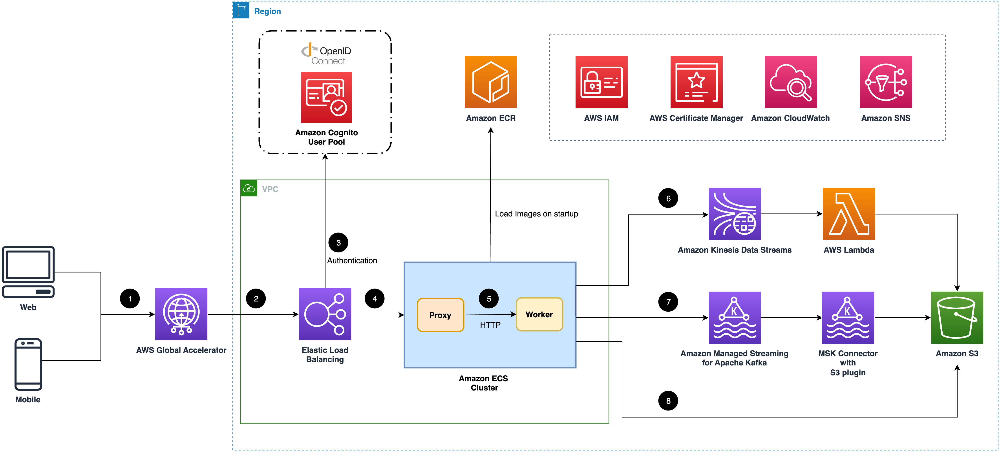
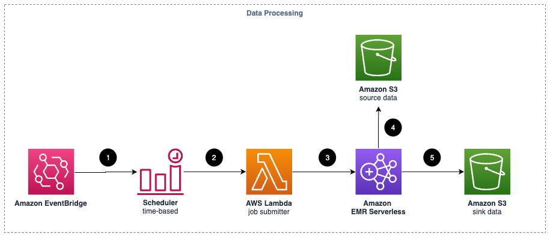
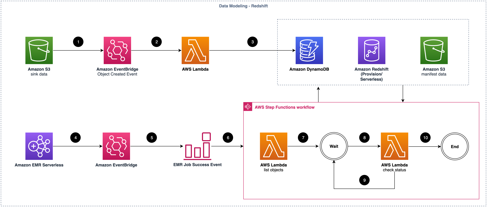

### Solution end-to-end architecture

Deploying this solution with the default parameters builds the following environment in AWS:

<figure markdown>
   { loading=lazy }
   <figcaption>Figure 1: Clickstream Analytics on AWS architecture</figcaption>
</figure>

This solution deploys the Amazon CloudFormation template in your AWS account and completes the following settings.

1. [Amazon CloudFront](https://aws.amazon.com/cloudfront) distributes the frontend web UI assets hosted in the [Amazon S3](https://aws.amazon.com/s3/) bucket, and the backend APIs hosted with [Amazon API Gateway](https://aws.amazon.com/api-gateway/) and [AWS Lambda](https://aws.amazon.com/lambda).
2. The [Amazon Cognito](https://aws.amazon.com/cognito) user pool or OpenID Connect (OIDC) is used for authentication.
3. The web UI console uses [Amazon DynamoDB](https://aws.amazon.com/dynamodb) to store persistent data.
4. [AWS Step Functions](https://aws.amazon.com/step-functions), [AWS CloudFormation](https://aws.amazon.com/cloudformation), AWS Lambda, and [Amazon EventBridge](https://aws.amazon.com/eventbridge) are used for orchestrating the lifecycle management of data pipelines.
5. The data pipeline is provisioned in the region specified by the system operator. It consists of Application Load Balancer (ALB),
[Amazon ECS](https://aws.amazon.com/ecs/), [Amazon Managed Streaming for Kafka (Amazon MSK)](https://aws.amazon.com/msk/), [Amazon Kinesis](https://aws.amazon.com/kinesis/) Data Streams, Amazon S3, [Amazon EMR](https://aws.amazon.com/emr/) Serverless, [Amazon Redshift](https://aws.amazon.com/redshift/), and [Amazon QuickSight](https://aws.amazon.com/quicksight/).

The key functionality of this solution is to build a data pipeline to collect, process, and analyze their clickstream data. The data pipeline consists of four modules: 

- ingestion module 
- data processing module 
- data modeling module 
- reporting module 

The following introduces the architecture diagram for each module.

### Ingestion module

<figure markdown>
   { loading=lazy }
   <figcaption>Figure 2: Ingestion module architecture</figcaption>
</figure>

Suppose you create a data pipeline in the solution. This solution deploys the Amazon CloudFormation template in your AWS account and completes the following settings.

!!! info "Note"
      The ingestion module supports three types of data sinks.

1. (Optional) The ingestion module creates an AWS global accelerator endpoint to reduce the latency of sending events from your clients (web applications or mobile applications).
2. [Elastic Load Balancing (ELB)](https://aws.amazon.com/elasticloadbalancing/) is used for load balancing ingestion web servers.
3. (Optional) If you enable the authenticating feature, the ALB will communicate with the OIDC provider to authenticate the requests.
4. ALB forwards all authenticated and valid requests to the ingestion servers.
5. Amazon ECS cluster is hosting the ingestion fleet servers. Each server consists of a proxy and a worker service. The proxy is a facade of the HTTP protocol, and the worker will send the events to a data sink based on your choice.
6. Amazon Kinesis Data Streams is used as a buffer. AWS Lambda consumes the events in Kinesis Data Streams and then sinks them to Amazon S3 in batches.
7. Amazon MSK or self-built Kafka is used as a buffer. MSK Connector is provisioned with an S3 connector plugin that sinks the events to Amazon S3 in batches.
8. The ingestion server will buffer a batch of events and sink them to Amazon S3.

### Data processing module

<figure markdown>
   { loading=lazy }
   <figcaption>Figure 3: Data processing module architecture</figcaption>
</figure>

Suppose you create a data pipeline in the solution and enable ETL. This solution deploys the Amazon CloudFormation template in your AWS Cloud account and completes the following settings.

1. Amazon EventBridge is used to trigger the ETL jobs periodically.
2. The configurable time-based scheduler invokes an AWS Lambda function.
3. The Lambda function kicks off an EMR Serverless application based on Spark to process a batch of clickstream events.
4. The EMR Serverless application uses the configurable transformer and enrichment plug-ins to process the clickstream events from the source S3 bucket.
5. After processing the clickstream events, the EMR Serverless application sinks the processed events to the sink S3 bucket.

### Data modeling module

<figure markdown>
   { loading=lazy }
   <figcaption>Figure 4: Data modeling in Redshift architecture</figcaption>
</figure>

Suppose you create a data pipeline in the solution and enable data modeling in Amazon Redshift. This solution deploys the Amazon CloudFormation template in your AWS Cloud account and completes the following settings.

1. After the processed clickstream events data is written in the Amazon S3 bucket, the `Object Created Event` is emitted.
2. An Amazon EventBridge rule is created for the event emitted in step 1, and an AWS Lambda function is invoked when the event happens.
3. The Lambda function persists the source event to be loaded in an Amazon DynamoDB table.
4. When data processing job is done, an event is emitted to Amazon EventBridge.
5. The pre-defined event rule of Amazon EventBridge processes the `EMR job success event`.
6. The rule invokes the AWS Step Functions workflow.
7. The workflow invokes the `list objects` Lambda function that queries the DynamoDB table to find out the data to be loaded, then creates a manifest file for a batch of event data to optimize the load performance.
8. After a few seconds, the `check status` Lambda function starts to check the status of loading job.
9. If the load is still in progress, the `check status` Lambda function waits a few more seconds.
10. After all objects are loaded, the workflow ends.

<figure markdown>
   { loading=lazy }
   <figcaption>Figure 5: Scan metadata architecture</figcaption>
</figure>

1. Once the load data workflow is completed, the scan metadata workflow will be triggered.
2. The Lambda function checks whether the workflow should be started or not. If the interval since the last workflow initiation is less than one day or if the previous workflow has not yet finished, the current workflow is skipped.
3. If it is necessary to start the current workflow, the `submit job` Lambda function is triggered.
4. The Lambda function submits the stored procedure of scan metadata job, initiating the metadata scanning process.
5. After a few seconds, the `check status` Lambda function starts to check the status of the scan job.
6. If the scan is still in progress, the `check status` Lambda function waits for a few more seconds.
7. Once the data scanning is completed, the `store metadata` Lambda function is triggered.
8. The Lambda function saves the metadata to the DynamoDB table, the workflow ends.

<figure markdown>
   { loading=lazy }
   <figcaption>Figure 6: Data modeling in Athena architecture</figcaption>
</figure>

Suppose you create a data pipeline in the solution and enable data modeling in Amazon Athena. This solution deploys the Amazon CloudFormation template in your AWS Cloud account and completes the following settings.

1. Amazon EventBridge initiates the data load into [Amazon Athena](https://aws.amazon.com/athena/) periodically.
2. The configurable time-based scheduler invokes an AWS Lambda function.
3. The AWS Lambda function creates the partitions of the [AWS Glue](https://aws.amazon.com/glue/) table for the processed clickstream data.
4. Amazon Athena is used for interactive querying of clickstream events.
5. The processed clickstream data is scanned via the Glue table.

### Reporting module

<figure markdown>
   { loading=lazy }
   <figcaption>Figure 7: Reporting module architecture</figcaption>
</figure>

Suppose you create a data pipeline in the solution, enable data modeling in Amazon Redshift, and enable reporting in Amazon QuickSight. This solution deploys the Amazon CloudFormation template in your AWS Cloud account and completes the following settings.

1. VPC connection in Amazon QuickSight is used for securely connecting your Redshift within VPC.
2. The data source, data sets, template, analysis, and dashboard are created in Amazon QuickSight for out-of-the-box analysis and visualization.

